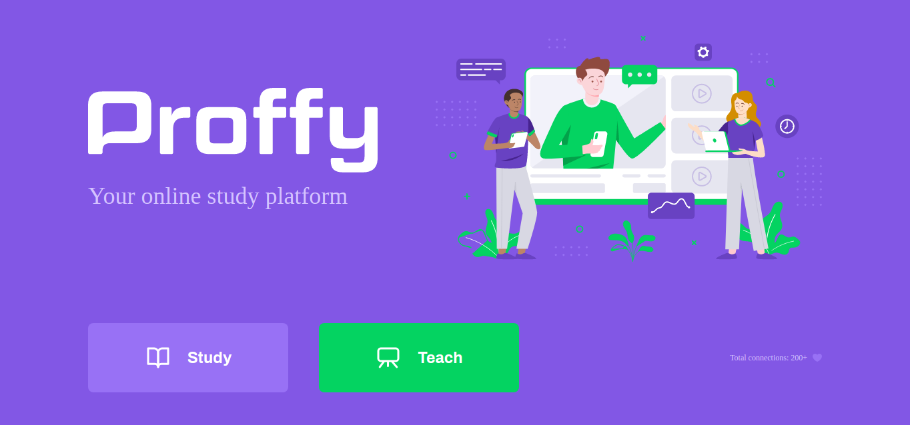
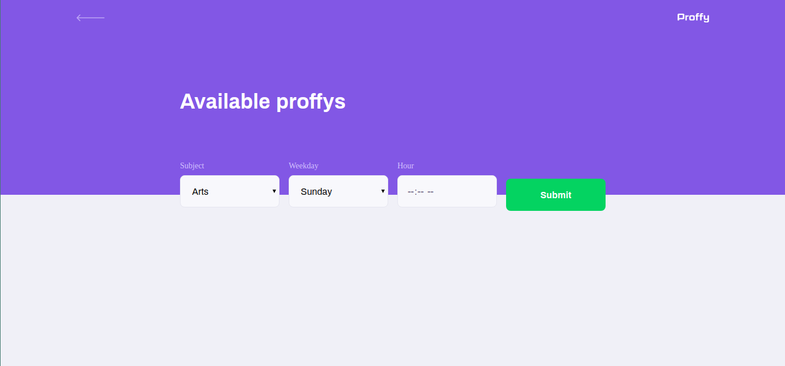
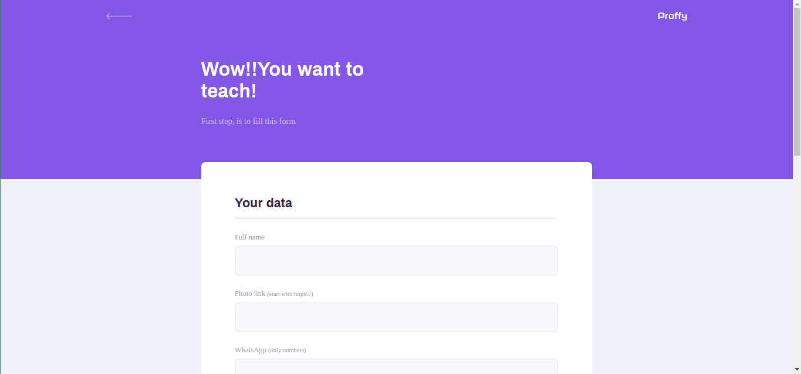
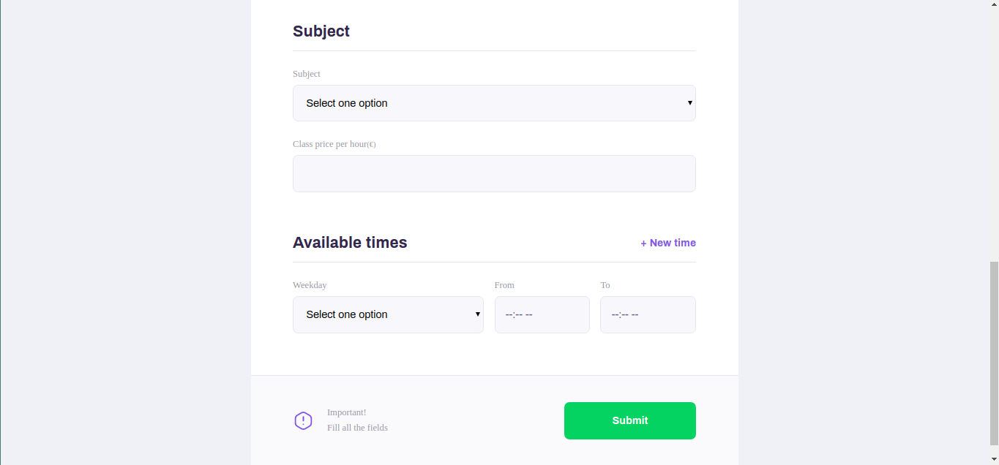

# Description:
Online teaching/study platform that facilitates cooperation between students and teachers.  

Landing page:
> Front page of our web site and the first thing the user will see

Study page:
> Search for a suitable professor and contact him automatically to set up a class

Teach page:
> Register and start giving classes to other people

# How to use:
Just need to set up node and run 'npm run dev'.  
After this, open your web browser in: http://127.0.0.1:5500/

# How to set up node:
Install/Update node using npm and on a git bash terminal, run this commands:  
+ 1º: npm init -y
+ 2º: npm install express
+ 3º: npm install nodemon -D
+ 4º: npm install nunjucks
+ 5º: npm install sqlite-async
+ 6º: inside package.json, create script: "dev": "nodemon src/server.js"
+ 7º: npm run dev

# Snapshots:
Landing page:

 
 
Study page:

 
 
Teach registration page:

 

